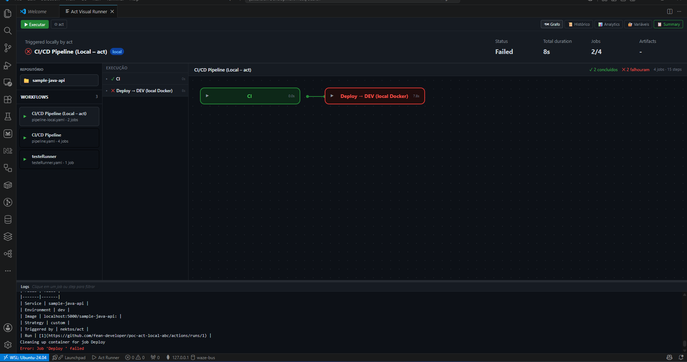
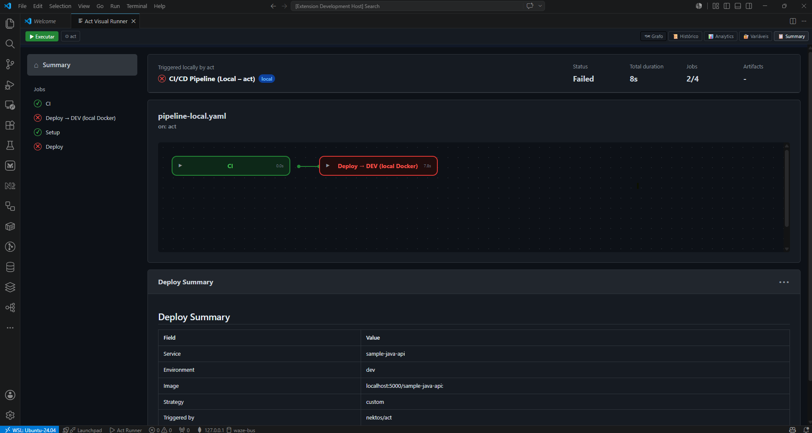
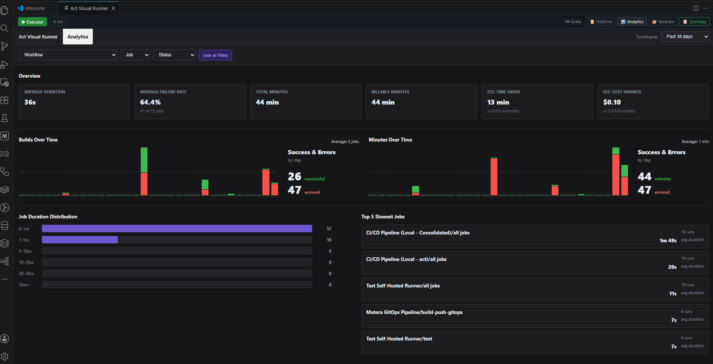

# Act/Run - GitHub Actions Visual localmente - Extensão para VS Code

[English](README.md) | **Português (Brasil)**

[](https://marketplace.visualstudio.com/items?itemName=fean-developer.act-visual-runner)
[](https://flat.badgen.net/github/release/fean-developer/act-visual-runner)
[](LICENSE)

Extensão para VS Code que executa workflows do GitHub Actions localmente usando [nektos/act](https://github.com/nektos/act) e visualiza a execução em tempo real por meio de um grafo interativo inspirado no n8n.


### Novo layout

- Interface integrada na barra lateral.
- A seleção do repositório abre na coluna principal do editor para uma experiência mais ampla.



### Summary

- Visualize o mesmo summary produzido pelo GitHub Actions.



### Analytics

- Consulte analytics baseados no histórico de execuções locais.



Esta extensão torna os testes locais de GitHub Actions mais produtivos ao oferecer uma interface visual intuitiva com feedback de execução em tempo real.

> [!IMPORTANT]
> Esta extensão requer o [nektos/act](https://github.com/nektos/act) instalado.

## Requisitos

- [nektos/act](https://github.com/nektos/act) instalado e disponível no `PATH`, ou configurado por meio de `actRunner.actPath`.
- Docker ou uma alternativa compatível, como Podman, Rancher Desktop ou OrbStack.
- VS Code 1.85 ou mais recente.

## Instalação

1. Abra o [Visual Studio Code Marketplace](https://marketplace.visualstudio.com/).
2. Pesquise por **Act/Run - GitHub Actions Visual locally**.
3. Selecione a extensão e clique em **Install**.

## Início rápido

1. Abra um repositório que contenha workflows em `.github/workflows/`.
2. Clique no ícone **ACT Runner** na barra de atividades.
3. Selecione um workflow no explorador e clique em **Run**.
4. O grafo abre automaticamente e exibe o status de cada job e step em tempo real.

## Comandos disponíveis

| Comando | Descrição |
|---|---|
| `Act: Run Workflow` | Executa um workflow completo |
| `Act: Quick Run` | Executa o workflow padrão sem prompts |
| `Act: Run Job` | Executa um job específico |
| `Act: Stop Execution` | Cancela a execução atual |
| `Act: Validate Workflow` | Valida o YAML do workflow |
| `Act: View History` | Exibe execuções anteriores |
| `Act: Docker Alternatives Guide` | Exibe alternativas gratuitas ao Docker Desktop |

## Configuração

| Configuração | Descrição | Padrão |
|---|---|---|
| `actRunner.actPath` | Caminho para o executável `act` | `act` (`PATH`) |
| `actRunner.defaultImage` | Imagem Docker padrão | `catthehacker/ubuntu:act-latest` |

Configure a extensão em **Preferences -> Settings -> Act Visual Runner**.

## Arquivos de configuração

Crie estes arquivos na raiz do projeto:

- **`.actrc`** - flags padrão do act, por exemplo `--platform ubuntu-latest=catthehacker/ubuntu:act-latest`.
- **`.secrets`** - secrets no formato `CHAVE=valor`.
- **`.env`** - variáveis de ambiente.

### Exemplo de `.actrc`

```bash
# Flags padrão do nektos/act. Este arquivo fica na raiz do projeto onde o act é executado.
--pull=false
-P ubuntu-latest=catthehacker/ubuntu:act-latest
--network platform_net
# --reuse
```

## Guia do usuário

Consulte o [guia do usuário em português](USER_GUIDE-pt-br.md) para obter instruções detalhadas. Consulte o [guia do usuário em inglês](USER_GUIDE.md) para a versão original.

## Licença

MIT
