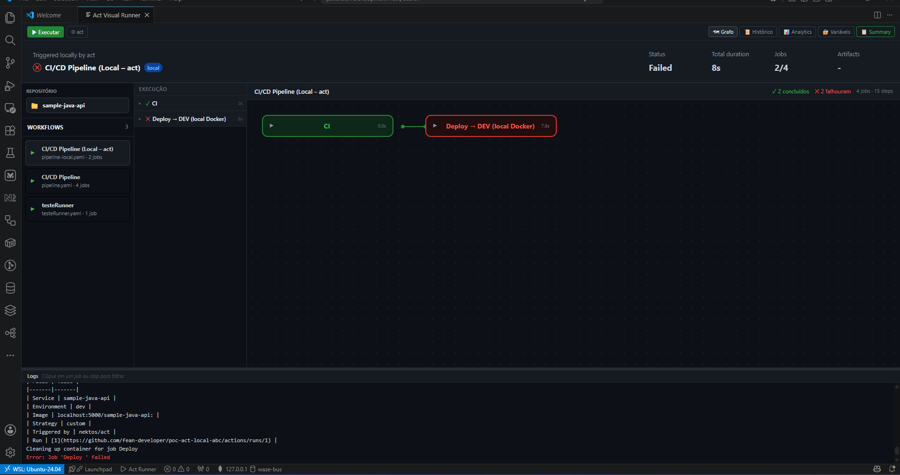
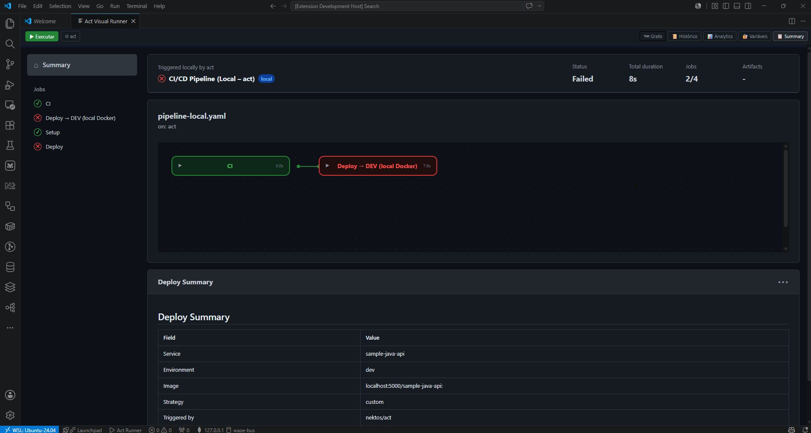
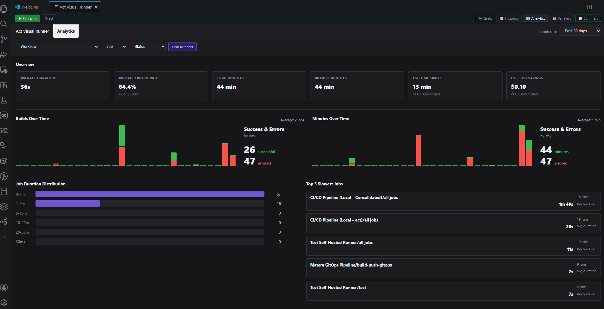

# Act/Run - GitHub Actions Visual locally - Extensão VS Code

[](https://img.shields.io/visual-studio-marketplace/v/fean-developer.act-visual-runner?style=flat-square&label=Visual%20Studio%20Marketplace)
[](https://flat.badgen.net/github/release/fean-developer/act-visual-runner)
[](LICENSE)

Extensão VSCode que executa workflows GitHub Actions localmente usando [nektos/act](https://github.com/nektos/act) e visualiza a execução em tempo real num grafo interativo estilo n8n.


### Nova visão
 - Sidebar interna na UI
 - Seleção de repositorio agora abre na coluna principal do editor para uma experiência de UI mais expandida
---


---

### Summary
 - Agora opção de ver o Summary o mesmo que aparece no Github



---

### Analytcs
 - Agora dispõe de um painel analytics baseado no historico de execuçoes locais



---

A finalidade dessa extensão é transformar a experiência de testar GitHub Actions localmente, oferecendo uma interface visual intuitiva e em tempo real que torna o desenvolvimento mais produtivo e satisfatório.

> [!IMPORTANT]
> Essa extensao executa somente com [nektos/act](https://github.com/nektos/act) instalado

## Pré-requisitos obrigatórios

- [nektos/act](https://github.com/nektos/act) instalado e acessível no PATH (ou configurado via `actRunner.actPath`)
- Docker (ou alternativa compatível como Podman, Rancher Desktop, OrbStack)
- VSCode 1.85+

## Instalação

 - Você acessa [ Visual Studio   |   Marketplace ](https://marketplace.visualstudio.com/) seleciona a opção
 Visual Studio Code.
 - Digite o nome da extensão "Act/Run - GitHub Actions Visual locally"
 - Selecione a extensão e clique em install
 - Automaticamente sera instalada no seu Vs Code

## Uso rápido

1. Abra um repositório que contenha workflows em `.github/workflows/`
2. Clique no ícone **Act Runner** na barra de atividades (lado esquerdo)
3. Selecione um workflow no Explorador → clique **▶ Executar**
4. O grafo abre automaticamente e exibe o status de cada job/step em tempo real

## Comandos disponíveis

| Comando | Descrição |
|---|---|
| `Act: Executar Workflow` | Executa um workflow completo |
| `Act: Quick Run` | Executa o workflow padrão sem prompts |
| `Act: Executar Job` | Executa um job específico |
| `Act: Parar Execução` | Cancela a execução em andamento |
| `Act: Validar Workflow` | Valida o YAML do workflow |
| `Act: Ver Histórico` | Exibe execuções anteriores |
| `Act: Guia Alternativas Docker` | Guia de alternativas gratuitas ao Docker Desktop |

## Configuração

| Setting | Descrição | Padrão |
|---|---|---|
| `actRunner.actPath` | Caminho do executável `act` | `act` (PATH) |
| `actRunner.defaultPlatform` | Plataforma Docker padrão | `ubuntu-latest=catthehacker/ubuntu:act-latest` |

Configure via **Preferences → Settings → Act Visual Runner**.

## Arquivos de configuração

Crie na raiz do projeto:

- **`.actrc`** — flags padrão do act (ex.: `--platform ubuntu-latest=catthehacker/ubuntu:act-latest`)
- **`.secrets`** — secrets em formato `CHAVE=valor`
- **`.env`** — variáveis de ambiente
# Exemplo .actrc
```bash
# ─────────────────────────────────────────────────────────────────────────────
# nektos/act default flags — must live at fean-projects/ root (where act is run).
#
# Invocation:
#   cd /path/to/local-repository
#   act push -W [name of repository]/.github/workflows/pipeline-local.yaml \
#            --secret-file [name of repository]/.secrets
#
# IMPORTANT: act parses this file by splitting on whitespace. Shell quoting is
#   NOT supported. Use --flag=value (no space) when the value contains special
#   characters. Never write: --flag="value with space"
# ─────────────────────────────────────────────────────────────────────────────

# Runner image — catthehacker has Docker CLI, curl, jq, Python, etc.  pre-installed.
# This overrides ~/.config/act/actrc which maps ubuntu-latest=node:16-buster-slim.

--pull=false
-P ubuntu-latest=catthehacker/ubuntu:act-latest

# Attach all job containers to the platform_net network (created by docker compose).
# Allows containers to reach: sonarqube:9000  localhost:5000  portainer:9443
--network platform_net

# Store upload-artifact / download-artifact data locally.
# Bind to 172.18.0.1 (platform_net gateway) so containers can reach the artifact server.
--artifact-server-path /tmp/act-artifacts
--artifact-server-addr 172.18.0.1

# Reuse containers between runs to avoid re-downloading SDKs (217MB .NET SDK etc.)
# Disabled: --reuse causes "No such container" errors when containers are cleaned between runs.
# Clean up manually when needed: docker rm -f $(docker ps -aq --filter "name=act-")
# --reuse

```

## User Guide

Veja o arquivo [USER GUIDE](USER_GUIDE.md) incluído na extensão para instruções detalhadas de uso.

## Buy me a Coffe
<br />
## Licença

MIT
